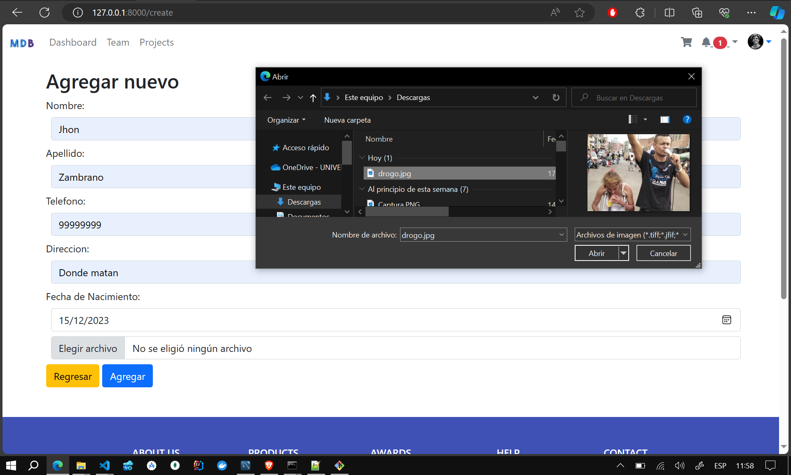
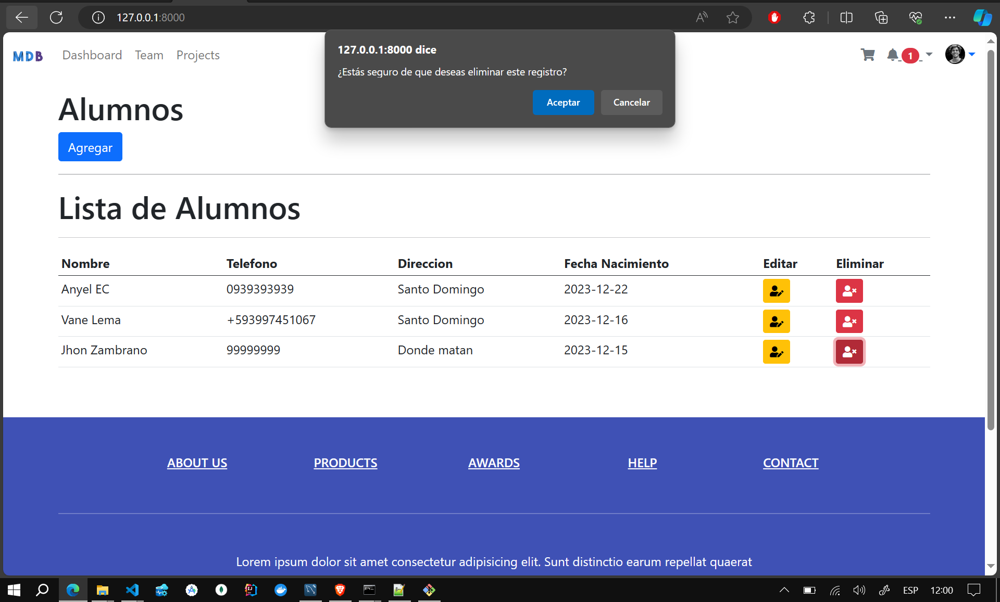

### Proyecto CRUD de Alumnos en Laravel

Este proyecto en Laravel implementa un sistema básico CRUD (Crear, Leer, Actualizar, Eliminar) para gestionar información de alumnos, incluyendo la posibilidad de almacenar imágenes de perfil.

**Seleccione el Lenguaje:**
- [Español (Spanish)](README-es.md)
- [English](README.md)

# Resultados
## Inicio 
 
## Crear 
 
## Editar 
 
## Eliminar 
 

#### Requisitos del Sistema

- PHP 8.2.4
- Composer 2.6.6

#### Instalación

1. Clona el repositorio en tu máquina local:

   ```bash
   git clone https://github.com/Anyel-ec/Laravel-MySQL-CRUD-UPLOAD-IMAGE
   ```

2. Accede al directorio del proyecto:

   ```bash
   cd Laravel-MySQL-CRUD-UPLOAD-IMAGE
   ```

3. Instala las dependencias con Composer:

   ```bash
   composer install
   ```

#### Configuración de la Base de Datos

1. Configura el archivo `.env` con los detalles de tu base de datos:

   ```dotenv
   DB_CONNECTION=mysql
   DB_HOST=127.0.0.1
   DB_PORT=3306
   DB_DATABASE=nombre_de_tu_base_de_datos
   DB_USERNAME=usuario_de_tu_base_de_datos
   DB_PASSWORD=contraseña_de_tu_base_de_datos
   ```

2. Ejecuta las migraciones para crear la tabla de alumnos:

   ```bash
   php artisan migrate
   ```

#### Uso del Proyecto

1. Ejecuta el servidor de desarrollo:

   ```bash
   php artisan serve
   ```

2. Accede a la aplicación en tu navegador: [http://localhost:8000](http://localhost:8000)

3. Navega por las diferentes secciones de la aplicación:

   - **Listado de Alumnos:** [http://localhost:8000/alumno](http://localhost:8000/alumno)
   - **Agregar Nuevo Alumno:** [http://localhost:8000/alumno/create](http://localhost:8000/alumno/create)
   - **Editar Alumno:** [http://localhost:8000/alumno/{id}/edit](http://localhost:8000/alumno/{id}/edit)

#### Almacenamiento de Imágenes

Las imágenes de perfil de los alumnos se almacenan en la carpeta `storage/app/uploads`. Para acceder a estas imágenes desde el navegador, sigue estos pasos:

1. Crea un enlace simbólico para la carpeta `storage`:

   ```bash
   php artisan storage:link
   ```

2. Las imágenes estarán disponibles en la URL:

   ```
   http://localhost:8000/storage/uploads/nombre_de_la_imagen.jpg
   ```

   Sustituye `nombre_de_la_imagen.jpg` por el nombre real de la imagen que deseas visualizar.

