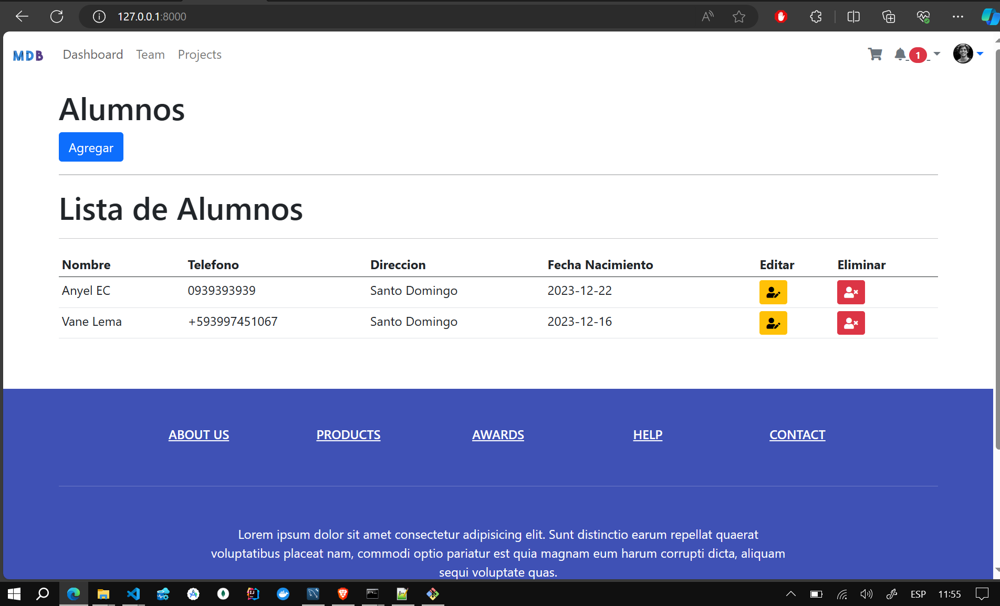

### Laravel MySQL CRUD with Image Upload

This Laravel project implements a basic CRUD (Create, Read, Update, Delete) system to manage student information, including the ability to upload profile images.


**Select Language:**
- [Español (Spanish)](README-es.md)
- [English](README.md)

# Results
## Home 
 
## Create 
 
## Edit 
 
## Delete 
 

# README 


#### System Requirements

- PHP 8.2.4
- Composer 2.6.6

#### Installation

1. Clone the repository to your local machine:

   ```bash
   git clone https://github.com/Anyel-ec/Laravel-MySQL-CRUD-UPLOAD-IMAGE
   ```

2. Navigate to the project directory:

   ```bash
   cd Laravel-MySQL-CRUD-UPLOAD-IMAGE
   ```

3. Install dependencies with Composer:

   ```bash
   composer install
   ```

#### Database Configuration

1. Configure the `.env` file with your database details:

   ```dotenv
   DB_CONNECTION=mysql
   DB_HOST=127.0.0.1
   DB_PORT=3306
   DB_DATABASE=your_database_name
   DB_USERNAME=your_database_user
   DB_PASSWORD=your_database_password
   ```

2. Run migrations to create the students' table:

   ```bash
   php artisan migrate
   ```

#### Usage

1. Run the development server:

   ```bash
   php artisan serve
   ```

2. Access the application in your browser: [http://localhost:8000](http://localhost:8000)

3. Navigate through different sections of the application:

   - **List of Students:** [http://localhost:8000/student](http://localhost:8000/student)
   - **Add New Student:** [http://localhost:8000/student/create](http://localhost:8000/student/create)
   - **Edit Student:** [http://localhost:8000/student/{id}/edit](http://localhost:8000/student/{id}/edit)

#### Image Storage

Student profile images are stored in the `storage/app/uploads` folder. To access these images from the browser, follow these steps:

1. Create a symbolic link for the `storage` folder:

   ```bash
   php artisan storage:link
   ```

2. Images will be available at the URL:

   ```
   http://localhost:8000/storage/uploads/image_name.jpg
   ```

   Replace `image_name.jpg` with the actual name of the image you want to view.